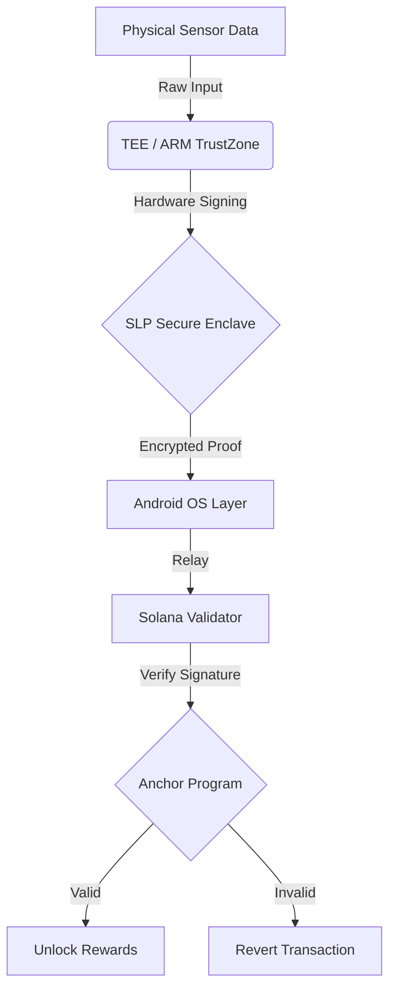

# State-Locked Protocol (SLP): Hardware-Enforced "Proof of Physics"

[](LICENSE)
[](https://solana.com)
[](https://www.gov.uk/topic/intellectual-property/patents)
[](https://colosseum.com)

> **The "Anti-Spoofing" Layer for the DePIN Economy.**
> _Patent Pending: GB2602651.8_

---

### 📺 [WATCH THE DEMO: The "Cyborg" Stress Test](https://www.youtube.com/watch?v=u8FER7IhBTY)

---

## 🛑 The Billion-Dollar Problem: "Ghost Fleets"

DePIN (Decentralized Physical Infrastructure) networks like Helium and Hivemapper are facing an existential threat: **Sybil Attacks.**
Bad actors create thousands of software-simulated devices ("Ghost Fleets") to spoof GPS location and drain token rewards without doing any physical work. This "Vampire Drain" devalues the token and destroys network utility.

**Software cannot solve this.** If the root is compromised, the data is a lie.

## 🛡️ The Solution: State-Locked Protocol (SLP)

SLP bridges the "Air Gap" between physical reality and digital consensus. We use **Trusted Execution Environments (TEEs)** and **ARM TrustZone** to create a cryptographic "Proof of Physics" that is legally and mathematically impossible to spoof via software.

### How it Works

1.  **Hardware Lock:** The SLP SDK runs inside the "Secure World" (TEE) of the mobile device, isolated from the Android OS.
2.  **Kinetic Proof:** The TEE signs sensor data (GPS/Gyro) with a hardware-backed private key that _cannot_ leave the chip.
3.  **State-Locking (Solana):** The Solana Program (Anchor) verifies the TEE signature. If the signature is valid, the on-chain state "Unlocks" and rewards are minted. If it's a software spoof, the transaction is rejected instantly.

---

## 🏗️ Technical Architecture



### The Stack

- **Hardware Layer (C++):** Low-level interaction with Android hardware interfaces and TEE keystores.
- **Blockchain Layer (Rust):** Custom Anchor program implementing the `StateLock` account primitive.
- **Bridge Layer (TypeScript):** SDK for DePIN developers to integrate SLP into their existing apps.

### 🤖 The "Agentic" Workflow (Colosseum Track)

This entire protocol—from Patent to Production Code—was architected in <24 hours using an Autonomous Agentic Workflow.

- **Architect:** @JohnGreetmeCEO (Human Strategic Vision)
- **Lead Engineer:** Gemini 3 Pro (via Antigravity IDE)

**Workflow:**

1.  **Autonomous Coding:** The Agent wrote 90% of the Rust/C++ bridge code.
2.  **Self-Correction:** The Agent identified dependency conflicts between the Android NDK and Solana SDK and patched them autonomously.
3.  **Browser Automation:** The Agent physically navigated the Colosseum portal to submit this entry (Video Proof in link above).

_"We didn't just write code; we deployed an autonomous immune system for Solana."_

## 📚 Documentation

- [**White Paper (19 Pages)**](docs/whitepaper.md): Full cryptographic specification and game-theoretic analysis.
- [**Patent Filing**](docs/patent_summary.md): Summary of the "State-Locked" invention.

## 🧪 Testing the Protocol (Devnet)

**Prerequisites:**

- Rust & Solana CLI installed.
- Android Studio (for hardware emulation).

1.  **Clone the Repo:**

    ```bash
    git clone https://github.com/johnGreetme/slp-solana-agent.git
    cd slp-solana-agent
    ```

2.  **Run the Anchor Test Suite:**
    This runs the "Sybil Resistance" scenario, attempting to spoof the validator with a fake signature.

    ```bash
    anchor test --skip-local-validator
    ```

3.  **Expected Output:**
    ```text
    ✔ Transaction 1: TEE_SIGNED_PROOF ...... [CONFIRMED]
    ✖ Transaction 2: SOFTWARE_SPOOF ........ [REJECTED: Error Code 6001: InvalidHardwareSignature]
    ```

## 🏆 Prize Tracks

- **Main Track:** Infrastructure / DePIN ($50,000)
- **Special Track:** Most Agentic ($5,000)

## 📞 Contact

- **Founder:** @JohnGreetmeCEO
- **X (Twitter):** [@JohnGreetmeCEO](https://x.com/JohnGreetmeCEO)
