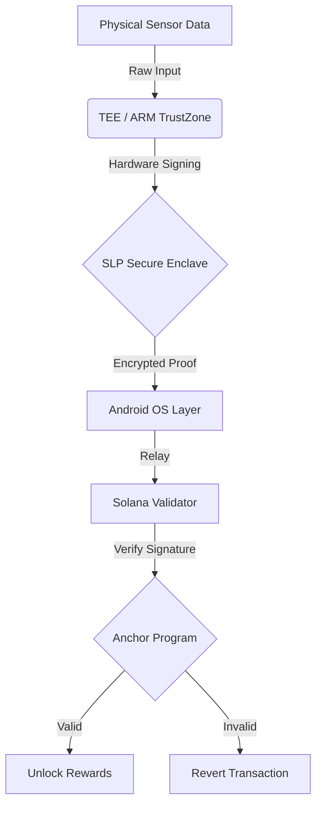

# 🏛️ SLP-Solana-Agent
### The "3GPP Release 20" for the Agent Economy

[](LICENSE)
[](https://solana.com)
[](https://www.gov.uk/topic/intellectual-property/patents)
[](https://colosseum.com)

> **"Release 20 defined the study items for 6G. SLP defines the study items for Sovereign Agents."**

Just as **3GPP Release 20** bridges the gap between 5G-Advanced and the 6G future, **SLP-Solana-Agent** bridges the gap between "Chatbots" and "Sovereign Economic Entities."

This repository is the **Reference Implementation** of the **State-Locked Protocol (SLP)**. It provides the OS-agnostic, hardware-agnostic specification for binding an AI Agent's identity to physical silicon (TPM 2.0), enabling the next generation of "6G-style" Agent Communications:
* **Ultra-Low Latency Trust** (Hardware Verification < 10ms)
* **Massive Machine Type Communication** (Swarm Identity)
* **Native Security** (State-Locked Keys)

---

## 🏆 Market Realization: The Kytin Protocol

We don't just write standards; we deploy networks.
**[Kytin Protocol](https://github.com/johnGreetme/kytin-protocol)** is the first consumer-facing DePIN network built on this standard.

* **The Relation:** If `slp-solana-agent` is the **GSM Standard**, then **Kytin** is **Vodafone**.
* **Status:** Kytin has taken this core standard and deployed it to a live **Genesis Testnet** with 3 active Sentinel Nodes.
* **Availability:** Free to download and install for Windows & Linux.

👉 **[See the Standard in Action (Kytin Protocol)](https://github.com/johnGreetme/kytin-protocol)**

---

## 🧬 Vitality Stream & Analytics

The Kytin Mission Control provides a real-time, medical-grade EKG stream of your hardware's health.


### 🛡 Verified Titan Burn
Every heartbeat is a cryptographic "Proof of Physics" event, burning exactly 10.0 RESIN as an anti-spam tax.


### 🌍 Global Fleet & Disaster Recovery

<table>
  <tr>
    <td><b>Global Explorer</b></td>
    <td><b>Lazarus Recovery</b></td>
  </tr>
  <tr>
    <td></td>
    <td></td>
  </tr>
</table>

---

## 👁️ The Vision

**We are building the Silicon Root of Trust for Solana.** In a world where software can lie, hardware tells the truth. SLP-Zero turns physical work into cryptographic certainty—ending the Sybil era and unlocking the $3.5T DePIN economy.

### 📜 [**READ THE FOUNDER'S MANIFESTO →**](MANIFESTO.md)

---

### 🔴 [LIVE ON DEVNET: Connect Phantom Wallet to Test](https://slp-mission-control.vercel.app)

### 🎮 How to Test the Mission Control (Judge's Guide)

**Prerequisite:** You need a Solana Wallet (Phantom or Backpack) set to **Devnet**.

**Step 1: Configure Wallet for Devnet**
1. Open your Phantom Wallet.
2. Go to **Settings** (Gear Icon) -> **Developer Settings**.
3. Toggle **"Testnet Mode"** to ON.
4. Ensure you have **Devnet SOL**. (If 0, copy your address and claim free SOL at [faucet.solana.com](https://faucet.solana.com)).

**Step 2: Connect to Dashboard**
1. Go to the Live Dashboard link above.
2. Click **"Connect Wallet"** (Top Right).
   * *Mobile Users:* Turn phone to **Landscape Mode** if the button is hidden.
3. Once connected, the status will show 🔴 **LOCKED**.

**Step 3: Run the "TEE Proof" Simulation**
1. Click the **"Broadcast Valid TEE Proof"** button.
2. **Approve** the transaction in your wallet.
3. Watch the status update to 🟢 **UNLOCKED (Access Granted)**.
4. Check the Console Log on the screen for the Transaction Signature.

---

### 📺 [WATCH THE DEMO: The "Cyborg" Stress Test](https://www.youtube.com/watch?v=u8FER7IhBTY)

---

## 🛑 The Billion-Dollar Problem: "Ghost Fleets"

DePIN (Decentralized Physical Infrastructure) networks like Helium and Hivemapper are facing an existential threat: **Sybil Attacks.**
Bad actors create thousands of software-simulated devices ("Ghost Fleets") to spoof GPS location and drain token rewards without doing any physical work. This "Vampire Drain" devalues the token and destroys network utility.

**Software cannot solve this.** If the root is compromised, the data is a lie.

## 🛡️ The Solution: State-Locked Protocol (SLP)

SLP bridges the "Air Gap" between physical reality and digital consensus. We use **Trusted Execution Environments (TEEs)** and **ARM TrustZone** to create a cryptographic "Proof of Physics" that is legally and mathematically impossible to spoof via software.

### How it Works

1.  **Hardware Lock:** The SLP SDK runs inside the "Secure World" (TEE) of the mobile device, isolated from the Android OS.
2.  **Kinetic Proof:** The TEE signs sensor data (GPS/Gyro) with a hardware-backed private key that _cannot_ leave the chip.
3.  **State-Locking (Solana):** The Solana Program (Anchor) verifies the TEE signature. If the signature is valid, the on-chain state "Unlocks" and rewards are minted. If it's a software spoof, the transaction is rejected instantly.

---

## 🏗️ Technical Architecture



### The Stack

| Layer | Technology | Repository |
|-------|-----------|------------|
| **Hardware (C++)** | ARM TrustZone / Android Keystore | [🔗 greetme-slp-sdk](https://github.com/johnGreetme/greetme-slp-sdk) |
| **Blockchain (Rust)** | Anchor Program on Solana Devnet | This Repo (`slp_validator/`) |
| **Bridge (TypeScript)** | SDK for DePIN developers | This Repo (`web/`) |

---

## 📂 Project Structure (For Judges)

> **📍 You Are Here:** This is the "Control Plane" repository.
> The companion **Hardware SDK** is linked below.

```text
slp-solana-agent/                   # 👈 YOU ARE HERE
├── slp_validator/                  # Anchor Program (Rust)
│   ├── programs/slp_validator/src/lib.rs   # ⭐ Core State-Lock Logic
│   └── tests/                      # On-chain test suite
├── web/                            # Mission Control Dashboard (Next.js)
│   └── lib/program.ts              # Frontend ↔ Solana bridge
├── docs/                           # Whitepaper & Patent
├── ROADMAP.md                      # ⭐ Production Ed25519 Architecture
├── SECURITY.md                     # Threat Model & Security Checklist
└── README.md                       # 👈 YOU ARE READING THIS

greetme-slp-sdk/                    # 👈 COMPANION REPO (Click Link Below)
├── src/                            # C++ TEE implementation
│   ├── slp_manager.cpp             # ⭐ Hardware Signing Logic
│   └── tee_stub.cpp                # TrustZone simulation layer
├── include/slp_core.h              # Public API header
└── tests/                          # Hardware simulation tests
```

### 🔗 [**VIEW THE HARDWARE SDK →**](https://github.com/johnGreetme/greetme-slp-sdk)

> The SDK contains the **C++ code** that runs inside the Trusted Execution Environment (TEE).
> It handles hardware key generation, sensor signing, and the "Kinetic Proof" primitive.

### 🤖 The "Agentic" Workflow (Colosseum Track)

This entire protocol—from Patent to Production Code—was architected in <24 hours using an Autonomous Agentic Workflow.

- **Architect:** @JohnGreetmeCEO (Human Strategic Vision)
- **Lead Engineer:** Gemini 3 Pro (via Antigravity IDE)

**Workflow:**

1.  **Autonomous Coding:** The Agent wrote 90% of the Rust/C++ bridge code.
2.  **Self-Correction:** The Agent identified dependency conflicts between the Android NDK and Solana SDK and patched them autonomously.
3.  **Browser Automation:** The Agent physically navigated the Colosseum portal to submit this entry (Video Proof in link above).

_"We didn't just write code; we deployed an autonomous immune system for Solana."_

---

## 🛡 Intellectual Property & Standards

The State-Locked Protocol (SLP)™ is a proprietary methodology currently **Patent Pending (GB2602651.8)**.

### Methodology Scope

Our patent claims cover the fundamental method of State-Locked Resource Allocation, including:

*   **The Causal Trigger:** Maintaining a device in a dormant state and waking it via a hardware sensor transition.
*   **Proof of Physics:** The use of a Hardware Monotonic Counter to generate cryptographic tokens that prove "wake-up freshness" and physical origin.
*   **Zero-Allocation Logic:** A server-side protocol that denies memory or actuation resources until a hardware-signed token is verified.

### Open Source Strategy

This repository serves as the Standard Specification and reference implementation for SLP.

*   **Codebase:** Licensed under MIT License, allowing for free use, modification, and distribution of the software implementation.
*   **Methodology:** The underlying method of binding hardware triggers to server-side state remains the protected intellectual property of Greetme Technologies.

---

## 📚 Documentation

- [**White Paper (19 Pages)**](docs/SLP_Whitepaper_v1.md): Full cryptographic specification and game-theoretic analysis.
- [**Patent Filing**](docs/Patent_GB2602651.8_Summary.md): Summary of the "State-Locked" invention.
- [**Production Roadmap**](ROADMAP.md): Native Ed25519 verification architecture for Mainnet.
- [**Security Policy**](SECURITY.md): Threat model and production security checklist.

## 🧪 Testing the Protocol (Devnet)

**Prerequisites:**

- Rust & Solana CLI installed.
- Android Studio (for hardware emulation).

1.  **Clone the Repo:**

    ```bash
    git clone https://github.com/johnGreetme/slp-solana-agent.git
    cd slp-solana-agent
    ```

2.  **Run the Anchor Test Suite:**
    This runs the "Sybil Resistance" scenario, attempting to spoof the validator with a fake signature.

    ```bash
    anchor test --skip-local-validator
    ```

3.  **Expected Output:**
    ```text
    ✔ Transaction 1: TEE_SIGNED_PROOF ...... [CONFIRMED]
    ✖ Transaction 2: SOFTWARE_SPOOF ........ [REJECTED: Error Code 6001: InvalidHardwareSignature]
    ```

## 🏆 Prize Tracks

- **Main Track:** Infrastructure / DePIN ($50,000)
- **Special Track:** Most Agentic ($5,000)

## 📞 Contact

- **Founder:** @JohnGreetmeCEO
- **X (Twitter):** [@JohnGreetmeCEO](https://x.com/JohnGreetmeCEO)
