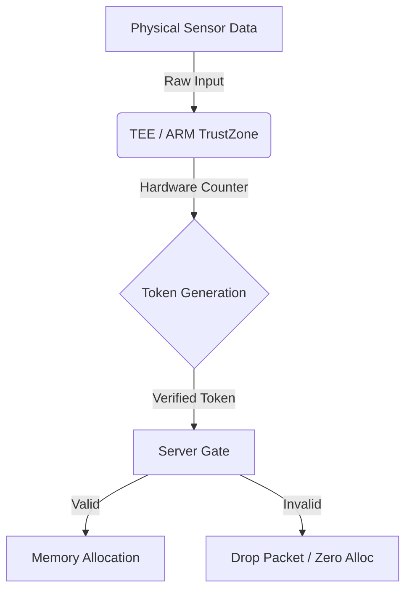

# The State-Locked Protocol

**A Zero-Allocation Standard for Verified Physical Compute**
_Version 1.1 | February 2026_
_By John A. Ogunyanwo_

---

## Table of Contents

1.  [Executive Summary](#1-executive-summary)
2.  [The Problem Landscape](#2-the-problem-landscape)
3.  [Core Technology](#3-core-technology)
4.  [Security Architecture](#4-security-architecture)
5.  [Tokenomics ($SLP)](#5-tokenomics-slp)

---

## 1. Executive Summary

The modern internet and DePIN networks face a scalability paradox. As we deploy billions of battery-constrained devices, the demand for "always-on" connectivity is destroying battery life. Simultaneously, "Sybil Attacks" and "Ghost Connections" (unverified bot sockets) are exhausting server memory.

**The Solution:** The State-Locked Protocol (SLP) is a patent-pending architecture that inverts the client-server relationship. Instead of the server managing the client, the client's physical hardware state dictates the server's memory allocation.

- **Dormant-by-Default:** Devices remain in a zero-power state until a verified "Foreground Pulse" occurs.
- **Zero-Allocation:** The server physically refuses to allocate RAM until a hardware-derived token is verified.
- **Proof of Physics:** We bind digital execution to physical energy expenditure (Battery Voltage Drop + Hardware Interrupt).

## 2. The Problem Landscape

### 2.1 The "Always-On" Trap

Current "Keep-Alive" heartbeats require radios to stay active, creating a "Parasitic Load" that reduces battery life by 40%. SLP replaces this with a "Dormant-by-Default" architecture.

### 2.2 The Sybil Crisis

Botnets exhaust server sockets by initiating thousands of "Ghost Connections." SLP introduces a physical cost (Thermodynamic Verification) to connection attempts, making Sybil attacks economically impossible.

### 2.3 Database Bloat

Servers pre-allocate memory for interactions that never happen. SLP enforces a "No Token = No Memory" rule.

## 3. Core Technology

### 3.1 Hardware-Software Interdependence

Server State (S) is functionally dependent on Client Hardware State (H).
`S = f(H)`

### 3.2 The Foreground Pulse

Instead of a continuous stream, SLP uses atomic pulses triggered by physical events (e.g., Screen Unlock, Drone Hover).

### 3.3 Zero-Allocation Database

The server maintains a "Null State" for all users. It performs a Header Inspection before `malloc()`. If the hardware token is invalid, the packet is dropped with zero memory allocated.

### Architecture Diagram

## 4. Security Architecture

### 4.1 Monotonic Counter Defense (Anti-Replay)

SLP anchors trust in a Hardware Monotonic Counter (TEE/TrustZone) that can only count up.
`Token = Hash(SensorData + (Counter+1) + PrivateKey)`
If `Counter_New <= Counter_Last`, the server rejects the request instantly.

### 4.2 The Robotic Air-Gap

For autonomous agents, the power line to actuators (motors) is gated. The software cannot move the arm unless the Hardware Trigger Circuit provides a valid token.

## 5. Tokenomics ($SLP)

- **Model:** Work Token (Utility).
- **Concept:** "Proof of Physical Work" (PoPW).
- **Value:** Tied to the physical energy cost of generating a verified pulse.
- **Burn:** A portion of fees from commercial verification (e.g., verifying a drone delivery) is burned.
